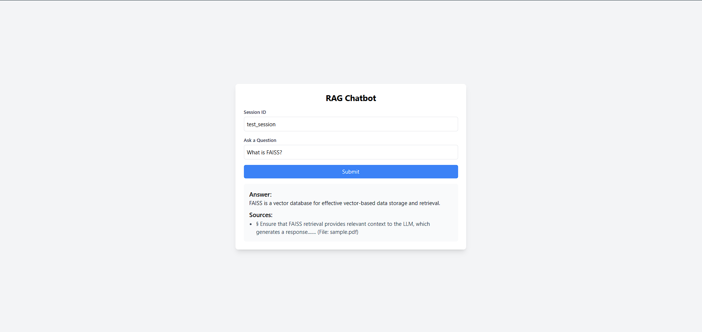

# 🧠 RAG Chatbot

A Retrieval-Augmented Generation (RAG) chatbot designed to answer user queries by retrieving relevant context from documents and generating accurate responses using a language model. Built as part of the RAG Chatbot Assessment, this project demonstrates document retrieval, question answering, and API integration using modern NLP tools.

## 🚀 Features

- 🔍 Retrieves relevant context from PDFs using FAISS (with `k=7` neighbors).
- 🤖 Generates answers using `google/flan-t5-base` via LangChain's `RetrievalQA`.
- 🌐 FastAPI `/chat` endpoint with optional source tracking.
- 💬 Simple HTML frontend (`index.html`) to interact with the chatbot.
- 🧪 Includes a debug script to test document retrieval.

## 📦 Setup

1. **Clone the Repository**

   ```bash
   git clone https://github.com/<your_username>/rag-chatbot.git
   cd rag-chatbot
`

2. **Create & Activate a Virtual Environment**

   ```bash
   python -m venv venv
   # Windows
   .\venv\Scripts\activate
   # macOS/Linux
   source venv/bin/activate
   ```

3. **Install Dependencies**

   ```bash
   pip install -r requirements.txt
   ```

4. **Download the Model (FLAN-T5)**

   ```bash
   python -c "from huggingface_hub import snapshot_download; snapshot_download(repo_id='google/flan-t5-base', local_dir='flan-t5-base')"
   ```

5. **Add your document**

   Place a PDF file named `sample.pdf` in the project directory.

6. **Run the FastAPI Server**

   ```bash
   uvicorn rag_chat_api:app --reload
   ```

7. **(Optional) Debug Retrieval**

   ```bash
   python debug_retrieval.py
   ```

## 🌐 Using the Frontend (`index.html`)

This project includes a lightweight HTML interface (`index.html`) for sending questions to the chatbot and displaying responses directly in the browser.

### Steps to Use:

1. Ensure the FastAPI server is running (`uvicorn rag_chat_api:app --reload`)
2. Open `index.html` in any modern browser (e.g., Chrome, Firefox)
3. Type a question and click **"Ask"** to receive a real-time response from the chatbot

---

## 🔗 API Usage

* **Endpoint:** `POST /chat`

* **Request Body:**

  ```json
  {
    "question": "What is FAISS?",
    "session_id": "test_session"
  }
  ```

* **Sample Response:**

  ```json
  {
    "answer": "FAISS is a library for efficient similarity search...",
    "sources": [
      {
        "content": "...",
        "filename": "sample.pdf"
      }
    ]
  }
  ```

* **Example cURL:**

  ```bash
  curl -X POST http://127.0.0.1:8000/chat \
       -H "Content-Type: application/json" \
       -d "{\"question\": \"What is FAISS?\", \"session_id\": \"test_session\"}"
  ```

* **Interactive Docs (Swagger UI):**

  [http://127.0.0.1:8000/docs](http://127.0.0.1:8000/docs)

---

## 📁 Project Structure

```
rag-chatbot/
├── rag_chat_api.py        # FastAPI server entrypoint
├── rag_chatbot.py         # LangChain-based RAG pipeline
├── debug_retrieval.py     # Script to test/document retrieval
├── sample.pdf             # Sample document (user-provided)
├── index.html             # Frontend interface (browser-based)
├── screenshots/           # Contains UI screenshot(s)
│   └── ui.png
├── requirements.txt       # Python dependencies
├── architecture.md        # Architecture overview (optional)
└── README.md              # This file
```

---

## 🖼️ Screenshot

Here’s how the HTML frontend looks when querying the chatbot:



---

## 🛠️ Technologies Used

* LangChain
* Hugging Face Transformers
* Sentence Transformers
* FAISS (Facebook AI Similarity Search)
* FastAPI
* PyMuPDF
* HTML/JavaScript (for frontend)

## 📌 Notes

* Set `k` in the FAISS retriever to control how many chunks to retrieve.
* This project is **local only** and does not require internet after the model is downloaded.

---


